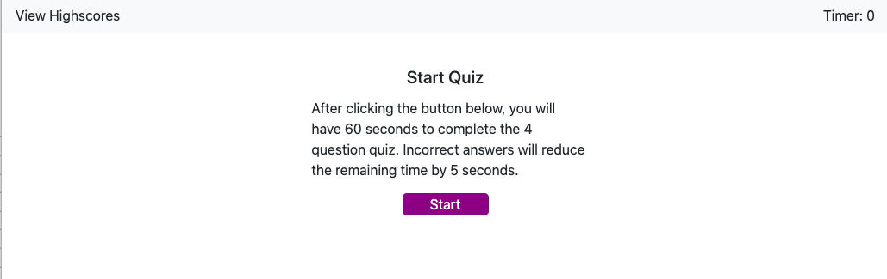
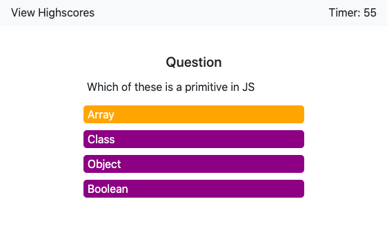
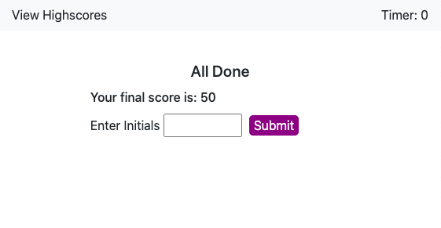
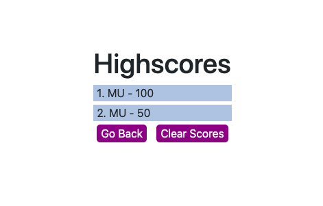

# Code Quiz

## Description

> A timed coding quiz for anyone looking to assess their own level of javascript knowledge. The quiz stores scores so you can see how you compare to your peers.

## Deployment

> Open in the brower.

## Features

> This project features a 4 question, timed quiz. The quiz has a responsive timer that reduces the time for incorrect answers. User initials and scores can be stored. The site is responsive and will render well on any device. 

## Images

> 
>
> 
>
> 
>
> 
>
> 